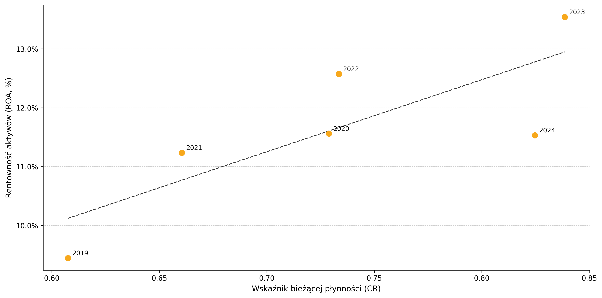

# Liquidity vs Profitability: Three WSE Retail Companies (2019–2024)

*The empirical work behind my bachelor's thesis — financial data taken from annual reports and
verified figure by figure, a rank correlation study of liquidity against profitability, and the
Polish macro backdrop it sits in. Python / pandas, reproducible end to end.*

Thesis: *"An Analysis of the Relationship Between Financial Liquidity and Profitability:
A Case Study of Selected Retail Companies Listed on the Warsaw Stock Exchange (GPW)
in 2019–2024"* — included in this repository as `praca_licencjacka.pdf` (in Polish).

---

## Overview

Three listed retail groups — **Dino Polska, LPP, CCC** — over six financial years.
Six ratios each: three for liquidity (CR, QR, ChR), three for profitability (ROS, ROA, ROE).
Every liquidity ratio is then correlated with every profitability ratio, per company:
**27 pairs in total.**

The project has two parts:

- **`r3_empirics/`** — the main thread. Ratios, normality testing, rank correlations, the
  tables and charts that appear in Chapter 3 of the thesis.
- **`r2_macro/`** — the macroeconomic backdrop (inflation, the NBP reference rate, retail
  sales dynamics) that Chapter 2 uses to frame the period. Standalone ETL pipeline.

The result is small: one correlation out of 27 crossed the significance threshold, and it
crossed it narrowly. Most of what is worth reading here concerns how the data was obtained and
how far the claim can be pushed.

---

## Where the data came from, and how it was checked

The 162 figures in `r3_empirics/data/dane_R3.csv` (18 company-years × 9 financial line items)
come from the consolidated annual reports of three capital groups, published on their investor
relations pages. They were extracted from those PDFs with Claude Cowork, then every figure was
checked by hand against the source report and the ratios recomputed in a spreadsheet:
`r3_empirics/walidacja/excel_double-verification.xlsx`. No script in this repository parses the
reports; the pipeline begins at the finished CSV.

The check found four wrong values, all of them in CCC. Three were the same field in consecutive
years — net result for 2021, 2022 and 2023 — and in each case the gap equalled CCC's
non-controlling interests exactly. A consolidated income statement carries two lines both called
"net profit (loss)", one for the group and one for owners of the parent, and the wrong one was
being read.

That explains why only CCC was affected. Dino reports no non-controlling interests; for LPP they
are 0.3% of the result. Only at CCC, which consolidates a partly-owned e-commerce arm, do the
two lines diverge — by 16%, 6% and 55%:

| | net result (group) | attributable to parent | ROE as reported | ROE from the wrong line |
|---|---|---|---|---|
| CCC 2021 | −192.3 m | −223.4 m | −16.70% | −19.40% |
| CCC 2022 | −443.9 m | −417.6 m | −76.18% | −71.67% |
| CCC 2023 | −124.7 m | −56.1 m | −13.08% | −5.88% |

Equity in this dataset is total equity, including non-controlling interests, so the numerator
has to be the group result. The wrong line would have paired a parent-only numerator with a
group-wide denominator and understated CCC's 2023 loss on equity by more than half.

The fourth error, CCC's current assets for 2023, has no such signature. The recorded figure
excludes assets held for sale, which is the right basis for a liquidity ratio; what was there
before the correction can no longer be determined, because the wrong values were overwritten
rather than kept beside the corrections. That is the one thing worth doing differently.

### One thing the tables do not show on their own

The column labelled "year" does not mean the same thing for every company:

| Company | Financial year |
|---|---|
| Dino | calendar year throughout |
| LPP | 1 Feb – 31 Jan, but **2019 = 1.01.2019–31.01.2020, i.e. 13 months** |
| CCC | 1 Feb – 31 Jan, but **2020 = 1.01.2020–31.01.2021, i.e. 13 months** |

Both companies changed their reporting year inside the study window. The two extended periods
inflate revenue and net income in those cells, which affects the numerator of ROS, ROA and ROE
for LPP 2019 and CCC 2020. Any reading of the profitability series has to carry that caveat.

---

## Method

Spearman's rank correlation, applied to all 27 pairs, unconditionally. Three reasons, in order
of weight:

1. **Extreme values.** CCC's ROE series contains an outlier — −413.27% in 2020, against a −76%
   to +53% range across its other five years, equity all but wiped out by losses. Spearman is
   far less sensitive to that than Pearson.
2. **Sample size.** With n = 6 per series there is no basis for leaning on a normality
   assumption; a normality test at that size is nearly blind.
3. **Comparability.** Coefficients produced by different methods cannot be compared with each
   other. One method across the whole table is what makes a sentence like *"the relationship is
   stronger at Dino than at CCC"* legitimate.

Shapiro-Wilk is reported as evidence for that choice rather than used as a selector. 17 of 18
series showed no departure from normality; the exception is CCC's ROE (W = 0.7182, p = 0.0096),
the same outlier as above. Using the test to pick a method per series would have filled one
table with coefficients that cannot be compared.

α = 0.05 throughout. Strength of association read off Guilford's scale.

The analysis is exploratory. At six observations per series the results indicate a tendency and
settle nothing — see the limitations section below.

### Consistency checks in the code

`r3_analysis.py` asserts that CR ≥ QR ≥ ChR for every row. The three ratios share a denominator
and have progressively narrower numerators, so the ordering holds by definition and a breach
means a figure sits in the wrong column — whether it was put there by a person or a tool.

ROE against ROA is left unchecked on purpose. It looks like a similar rule, and it holds in 12
of 18 rows, but in the six loss-making years (LPP 2020, CCC 2019–2023) ROE falls below ROA:
with a negative numerator, the smaller denominator deepens the minus. That is a property of the
data rather than of the definitions, so asserting it would turn a finding into a crash.

---

## Results

One significant correlation out of 27: Dino, CR–ROA, rs = 0.8286, p = 0.0416 — strong and
positive on Guilford's scale. The remaining 26 pairs do not reach α = 0.05.



### Limitations — what "significant" is worth here

Spearman's coefficient is computed from ranks, and with six observations there are only so many
ways to arrange six ranks. The coefficient can therefore take just 36 distinct values, each with
one fixed p-value attached. The top of that ladder:

| rs | p | |
|---|---|---|
| 1.0000 | 0.0000 | significant |
| 0.9429 | 0.0048 | significant |
| 0.8857 | 0.0188 | significant |
| 0.8286 | 0.0416 | significant ← the Dino result |
| 0.7714 | 0.0724 | not significant |
| 0.7143 | 0.1108 | not significant |

Two things follow. The Dino result sits on the last rung that fits under the threshold: swap
the ranks of any two years and it drops to 0.7714, p = 0.0724, and the conclusion goes away.
And because every rs on this ladder comes with a fixed p, testing at α = 0.05 is the same thing
as asking whether rs ≥ 0.8286 — the p-value repeats what the coefficient has already said.

Repeated identical coefficients in the output — three LPP pairs all at −0.7714 — come from the
same coarseness. With six observations, rankings coincide easily.

With 27 tests at this power, one hit is within what chance produces. The defensible claim is
that one relationship crossed the threshold, narrowly.

---

## The macro backdrop (`r2_macro/`)

Three official series — CPI from GUS, the NBP reference rate, and retail sales dynamics —
each built as a single pandas method chain, then joined on a shared year index.

| Year | CPI (%) | NBP reference rate (%) | Retail sales, constant prices (% YoY) |
|---|---|---|---|
| 2019 | 2.3 | 1.50 | 5.4 |
| 2020 | 3.4 | 0.10 | −3.1 |
| 2021 | 5.1 | 1.75 | 8.1 |
| 2022 | 14.4 | 6.75 | 5.0 |
| 2023 | 11.4 | 5.75 | −2.7 |
| 2024 | 3.6 | 5.75 | 2.7 |

Sources: [GUS – CPI](https://stat.gov.pl/obszary-tematyczne/ceny-handel/wskazniki-cen/wskazniki-cen-towarow-i-uslug-konsumpcyjnych-pot-inflacja-/roczne-wskazniki-cen-towarow-i-uslug-konsumpcyjnych/) ·
[NBP – interest rate archive (XML)](https://static.nbp.pl/dane/stopy/stopy_procentowe_archiwum.xml) ·
[GUS – DBW](https://dbw.stat.gov.pl/baza-danych) · [GUS – BDL](https://bdl.stat.gov.pl/bdl/dane/podgrup/tablica).
Each arrives with its own problem: `cp1250` encoding, `;` separators, decimal commas, a
"wide" layout, and no API at all for historical NBP rates — only an XML archive, read with
`.asof()` to take the rate in force on 31 December.

### The deflator investigation — a reconstruction that failed

Official *real* retail-sales dynamics for the ">9 employees" firm group are published only in
PDF bulletins. Rather than copy them across, I tested whether I could reconstruct them: derive
an implied deflator from the full-population series (which reports both nominal value and
official real dynamics), apply it to the >9 group's nominal sales, and compare the result
against the published figures.

The error was near zero in low-inflation years and grew to −2.5 pp as inflation rose. The
full-population deflator includes micro-firms and overstates prices for the >9 group; GUS
itself uses weighted, product-level deflators that cannot be reproduced from aggregates.

The reconstruction was therefore rejected and the official figures used, with the simulation
left in the code as a record of the check. What I took from it: when the target value already
exists, use it and automate its retrieval; reconstruct only where nothing official exists, and
establish the error profile before trusting the reconstruction.


---

## How to run

```bash
# requires Python 3.13 + uv
uv sync

uv run python r2_macro/main.py          # macro table + chart (needs internet: NBP XML)
uv run python r3_empirics/r3_report.py  # 7 charts + 10 CSV tables -> r3_empirics/output/
```

`uv sync` builds a version-pinned environment from `pyproject.toml` and `uv.lock`, so the
project runs from a clean machine.

`r3_analysis.py` computes and writes nothing; `r3_report.py` imports it and owns every side
effect. That split means the analysis can be imported and re-run freely — from a notebook,
for instance — without regenerating files on every reload.

---

## Repo structure

```
├── r2_macro/
│   ├── main.py                  # CPI + NBP rate + retail sales -> table + chart
│   ├── deflator_analysis.py     # retail sales module + the deflator investigation
│   ├── data/                    # raw GUS / NBP source files
│   └── output/wykres_makro.png
├── r3_empirics/
│   ├── data/dane_R3.csv         # 162 figures from the reports (thousands of PLN)
│   ├── r3_analysis.py           # ratios, Shapiro-Wilk, Spearman - computes only
│   ├── r3_report.py             # charts and CSV tables - all file writing
│   ├── walidacja/               # independent Excel re-computation
│   └── output/                  # 7 charts + 10 tables
├── praca_licencjacka.pdf        # the thesis itself (Polish)
├── pyproject.toml / uv.lock
├── LICENSE
└── README.md
```

Code is MIT-licensed. The thesis PDF is included for reference and is not covered by it.

## Tech

pandas (method chaining, `.assign`, `pivot_table`, ordered `CategoricalDtype`, `.stack`,
`.asof`, `join`), SciPy (`shapiro`, `spearmanr`), matplotlib, XML parsing, and a fair amount
of coaxing messy public-sector data into shape.
