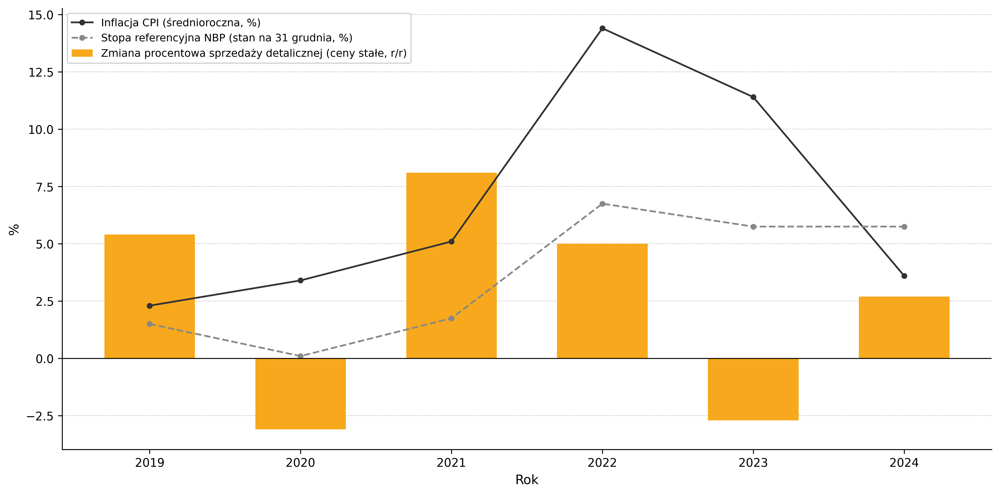

# Polish Macro Indicators: Inflation, Interest Rates & Retail Sales (2019–2024)

*A reproducible data pipeline in Python / pandas that pulls three official Polish macroeconomic series, cleans them, and combines them into one comparable table and chart.*

## Overview

This project involves the collection, processing, and presentation of the empirical data that provides the macroeconomic backdrop for my bachelor's thesis, *"An Analysis of the Relationship Between Financial Liquidity and Profitability: A Case Study of Selected Retail Companies Listed on the Warsaw Stock Exchange (GPW) in 2019–2024."*

To do this I used Python — primarily the pandas library — aiming for simple, readable, and (despite the small dataset) optimal code in the spirit of Matt Harrison's *Effective Pandas*. The pipeline produces the summary table and combination chart that form the macroeconomic background in Chapter 2 of the thesis. pandas and matplotlib let me structure, interpret, and present the data in the visually consistent format required in academic work.

## Data sources

All data comes from official Polish public institutions — **GUS** (Główny Urząd Statystyczny / Statistics Poland) and **NBP** (Narodowy Bank Polski / National Bank of Poland):

| Series | Source | Format / challenge |
|---|---|---|
| CPI (annual inflation, prev. year = 100) | GUS | CSV — `cp1250` encoding, `;` separator, comma decimals |
| NBP reference rate | NBP | XML archive — no API for historical rates |
| Retail sales, full population | GUS – DBW (Dziedzinowe Bazy Wiedzy) | CSV — comma decimals |
| Retail sales, firms with >9 employees | GUS – BDL (Bank Danych Lokalnych) | CSV — "wide" layout |

Both retail files feed a single series in the final table (constant-price sales dynamics); they are combined in the deflator step below.

Links: [GUS – CPI](https://stat.gov.pl/obszary-tematyczne/ceny-handel/wskazniki-cen/wskazniki-cen-towarow-i-uslug-konsumpcyjnych-pot-inflacja-/roczne-wskazniki-cen-towarow-i-uslug-konsumpcyjnych/) · [NBP – interest rates XML](https://static.nbp.pl/dane/stopy/stopy_procentowe_archiwum.xml) · [GUS – DBW](https://dbw.stat.gov.pl/baza-danych) · [GUS – BDL](https://bdl.stat.gov.pl/bdl/dane/podgrup/tablica). DBW and BDL are interactive portals, so the retail datasets are selected in the browser rather than downloaded from a direct file link.

## Methodology

**Pipeline (ETL).** Each series is built as a single pandas method chain (Effective Pandas style —
no in-place mutation, no row loops), then the three are joined on a shared year index:

- **CPI** — filter years, fix Polish decimal commas, set year as index.
- **NBP rate** — parse the two-level XML tree, flatten it to a table, keep the *reference* rate, and
  use `.asof()` to read the rate in force on 31 December of each year.
- **Retail sales** — reshape the "wide" GUS file and compute year-over-year dynamics.

### Highlight — the deflator investigation

Official real retail-sales dynamics for the ">9 employees" firm group are only published in PDF
bulletins. Instead of copying them blindly, I tested whether I could **reconstruct** them: I derived
an implied deflator from the full-population series (which reports both nominal value and official
real dynamics) and applied it to the >9 group's nominal sales. I then compared this simulation
against the official figures as a correctness check.

The error was ~0 in low-inflation years but grew to −2.5 pp as inflation rose — the full-population
deflator (which includes micro-firms) overstates prices for the >9 group, and GUS itself uses
weighted, product-level deflators that can't be reproduced by hand. So I **documented the failure and
used the official figures**, keeping the simulation in the code as evidence of the process.

This simulation taught me that when the target data is available, you should use it directly — even if
it isn't in a single consolidated file — rather than wasting time recreating or simulating it. If
needed, its retrieval from the original sources can be automated instead. The reconstruction method is
still useful when no official value exists, so it is worth knowing — together with its limitations.

## Key results

| Year | CPI (%) | NBP reference rate (%) | Retail sales, constant prices (% YoY) |
|---|---|---|---|
| 2019 | 2.3 | 1.50 | 5.4 |
| 2020 | 3.4 | 0.10 | −3.1 |
| 2021 | 5.1 | 1.75 | 8.1 |
| 2022 | 14.4 | 6.75 | 5.0 |
| 2023 | 11.4 | 5.75 | −2.7 |
| 2024 | 3.6 | 5.75 | 2.7 |

Among the three indicators, inflation showed the highest volatility over the period. It rose very
sharply between 2019 and 2022, reaching a 21st-century record for Poland, and was then followed by an
equally rapid decline to around 3.6% in 2024 YoY.

The NBP reference rate — except in the COVID-19 year of 2020 — was raised in tandem with rising
inflation. When inflation began to fall, the rate did not return to its earlier lows but stayed near
its peak. These conditions limited real retail sales growth: sales fell in two years, and the apparent
growth in the following years was mainly due to the low base of the year before. Growth did occur over
the period as a whole, but the impact of COVID-19 and of the inflation shock on consumer behaviour is
clearly visible.



## How to run

```bash
# requires Python 3.13 + uv
uv sync
uv run python main.py   # builds the summary table + chart -> output/wykres_makro.png
```

`uv sync` builds a fresh, version-pinned environment from `pyproject.toml` and `uv.lock`, so the
project runs from a clean setup regardless of your local machine. The script downloads the NBP rates
live, so an internet connection is required.

## Tech & skills

pandas (method chaining, `pivot_table`, `join`, `.asof`, `.shift`), XML parsing (`ElementTree`),
matplotlib, and handling messy government data (encodings, separators, decimal commas, wide layouts)
— plus the analytical part: validating a derived metric against ground truth.

## Repo structure

```
bachelors_thesis/
├── data/                    # raw source files (GUS, NBP)
│   ├── CPI.csv
│   └── growth rate/
├── output/
│   └── wykres_makro.png
├── deflator_analysis.py     # retail-sales module + deflator investigation
├── main.py                  # main pipeline: CPI + NBP + sales -> table + chart
├── pyproject.toml
└── README.md
```
